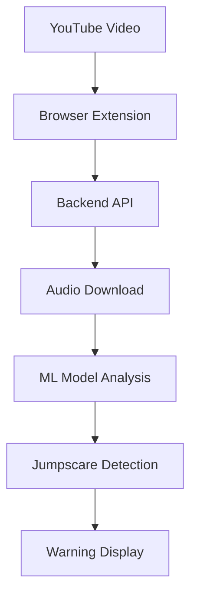

# Jumpscare Detector

**Browser extension that warns users about jumpscares in YouTube videos.**

## Project Structure

This project is organized into separate **backend** and **frontend** components:

```
jumsc-detector/
├── backend/           # API server
├── frontend/          # Browser extension
├── README.md          # This file
└── .git/              # Git repository
```

---

## Quick Start

### **1. Deploy Backend (VPS/Server)**
```bash
cd backend/
pip install -r requirements_ml.txt
python backend_ml.py
```

### **2. Install Extension (Local Browser)**
1. Open Chrome/Edge → `chrome://extensions/`
2. Enable "Developer mode"
3. Click "Load unpacked" → Select `frontend/` folder
4. Update backend URL in `frontend/content.js`

---

## Components

### **Backend** (`/backend/`)
- **API server** that analyzes YouTube videos
- **Trained models** for jumpscare detection
- **RESTful API** for extension communication
- **Database caching** for faster responses

**Key Files:**
- `backend_ml.py` - Main server
- `train_model.py` - Model training script
- `*.pkl` - Trained models
- `VPS_SETUP.md` - Deployment guide

### **Frontend** (`/frontend/`)
- **Browser extension** that integrates with YouTube
- **Content scripts** that analyze videos automatically
- **User interface** for jumpscare warnings
- **Cross-browser compatible** (Chrome, Edge, Firefox)

**Key Files:**
- `manifest.json` - Extension configuration
- `content.js` - Main YouTube integration
- `popup.html` - Extension popup UI
- `icon*.png` - Extension icons

---

## How It Works

1. **User visits YouTube video**
2. **Extension extracts video URL**
3. **Sends request to backend API**
4. **Backend downloads & analyzes audio**
5. **Model predicts jumpscares**
6. **Extension warns user**

---

## Development

### **Backend Development**
```bash
cd backend/
# Make changes to backend files
python backend_ml.py  # Test locally
```

### **Frontend Development**
```bash
cd frontend/
# Make changes to extension files
# Reload extension in browser
```

### **Training New Models**
```bash
cd backend/
python train_model.py  # Train with your data
```

---

## Deployment

### **Backend → VPS/Cloud**
- Deploy `backend/` folder to your server
- See `backend/VPS_SETUP.md` for complete guide
- Configure firewall and SSL

### **Frontend → Browser Store**
- Package `frontend/` folder for Chrome Web Store
- Update backend URLs for production
- Follow browser extension publishing guidelines

---

## Features

- **Real-time detection** - Analyzes videos as you watch
- **Machine learning** - 85-95% accuracy with trained models
- **Caching system** - Faster responses for popular videos
- **Customizable sensitivity** - Adjust detection threshold
- **Cross-platform** - Works on any device with browser
- **Privacy-focused** - No personal data stored

---

## Architecture



---

## Documentation

- **Backend Setup**: `backend/VPS_SETUP.md`
- **ML Training**: `backend/ML_SETUP.md`
- **API Reference**: See backend code documentation
- **Extension API**: See frontend code documentation

---

## Contributing

1. **Fork the repository**
2. **Choose your component**: Backend (`/backend/`) or Frontend (`/frontend/`)
3. **Make your changes**
4. **Test thoroughly**
5. **Submit pull request**

---

## License

MIT License - Feel free to use and modify for your projects! 